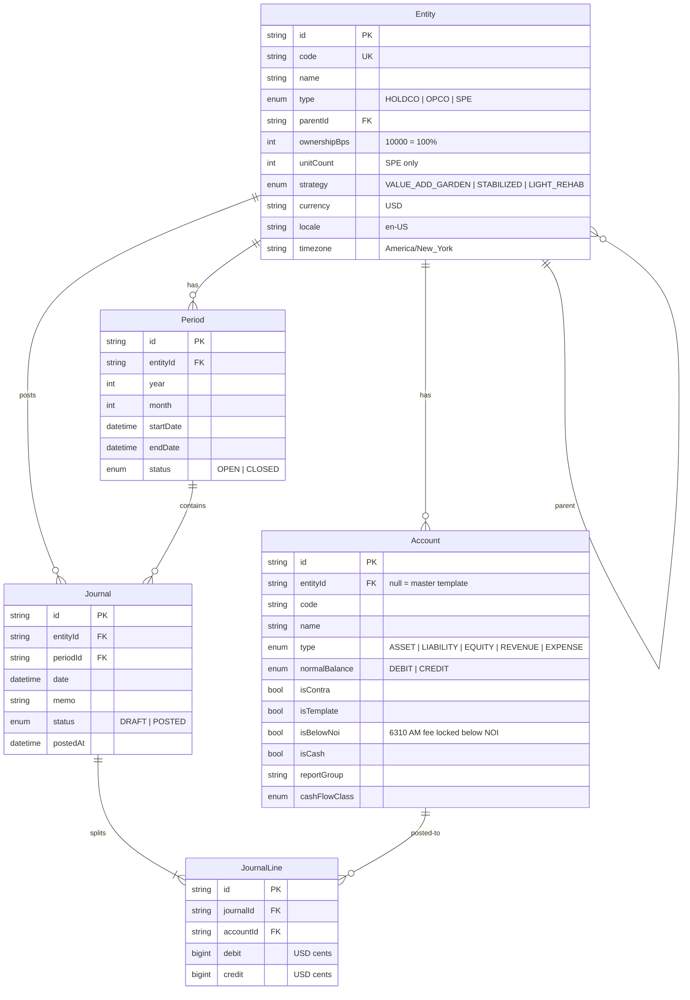

# Phase A Entity-Relationship Diagram

Roche Capital Partners ledger — book basis, USD cents (`BigInt`), `America/New_York`.



## Tree

```
Roche Capital Partners HoldCo
└── RCP Operating Company LLC
    ├── Willow Bend Gardens LLC          (SPE, 264 units, value-add garden, 100%)
    ├── Crestview Commons LLC            (SPE, 192 units, stabilized, 100%)
    └── Harbor Court Residences LLC      (SPE, 84 units, light rehab, 100%)
```

Wholly owned SPEs consolidate into OpCo. Intercompany `1310`/`2310` and AM fee `6310`/`7010` eliminate on the OpCo consolidated view.

## Posting rule

A journal may move from `DRAFT` to `POSTED` only when:

- at least two lines exist
- no line carries both a debit and a credit
- `sum(debit) == sum(credit)` (integer cents)
- every account belongs to the journal’s entity CoA
- the period is `OPEN`

Master CoA template rows have `entityId = null` and `isTemplate = true`. Creating an entity clones the template onto that entity.
